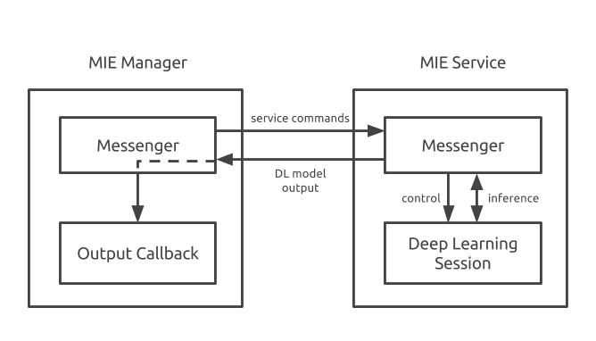
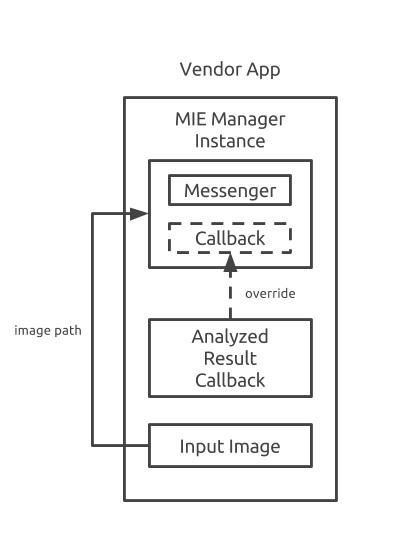

# MIE Skeleton

MIE skeleton demonstrates how to use MIE manager to communicate with MIE service, and what are the architectures of MIE manager and MIE service.

# Development Environment

Android Studio 2.2.2.

# MIE: Mobile Inference Engine

When MIE gets an image, it will send the image to a deep learning model, and receive the analyzed results. The way how the images will be analyzed depends on the deep learning (DL) model embedded in MIE. For example, given a dog image, a model might return is the object in it a dog, or return the breed of the dog.

MIE consists of MIE service and MIE manager:

  * MIE service can start or stop a DL session. After a DL session is started, MIE service can send input image to the DL session for analysis, and receive the results.
  * MIE manager can start or stop a MIE service. After a MIE service is started, MIE manager can send input image information to a MIE service, and pass the analyzed results to a callback for further process.

To integrate MIE into a mobile app, here are the steps:

 1. Create a MIE manager instance.
 1. Create your own callback for handling the analyzed results.
 1. Overwrite the original callback in MIE manager.

After integration, the mobile app can use MIE manager to manage MIE service or to start a DL analysis for input images. App developer only need to prepare input data, and interact with MIE manager without the need to know MIE service’s details. All the DL tasks will be done by MIE service in background.
